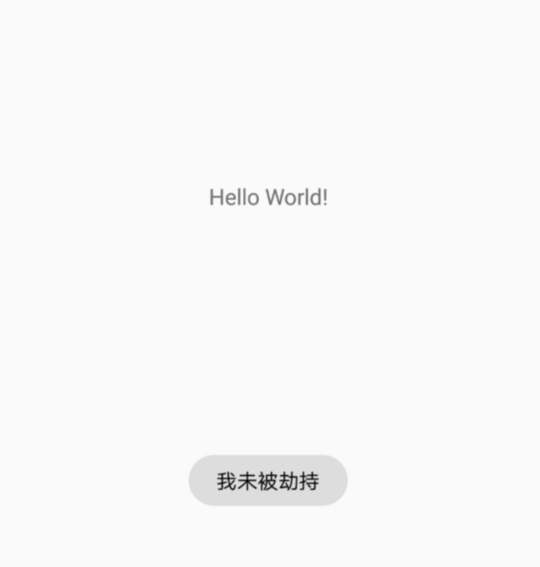
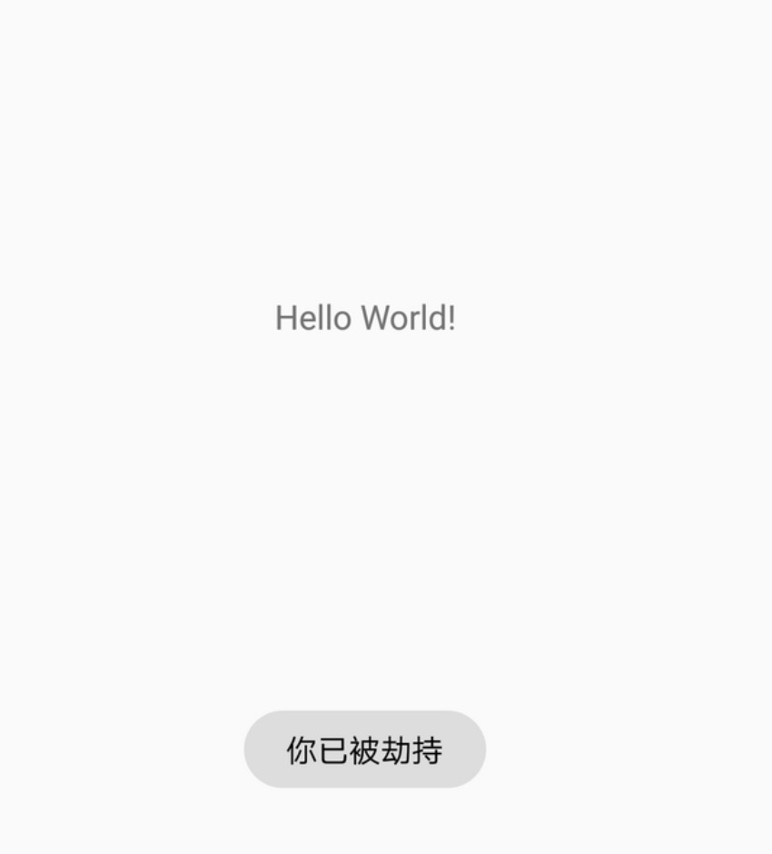

# android_TestHook
安卓逆向简单Demo

## 安卓逆向入门Demo

非常适合新手的教程，[新手不要再被误导！这是一篇最新的Xposed模块编写教程](https://www.freebuf.com/articles/terminal/189021.html) 

根据原文作者的操作步骤，一步一步实现Hook流程，强烈推荐根据原文操作一遍。

点击button,提示信息”我未被劫持“，hook之后提示”我已被劫持“

<t/>

## 测试环境
- Android 4.4.4

## 关注公众号：逆向APP

